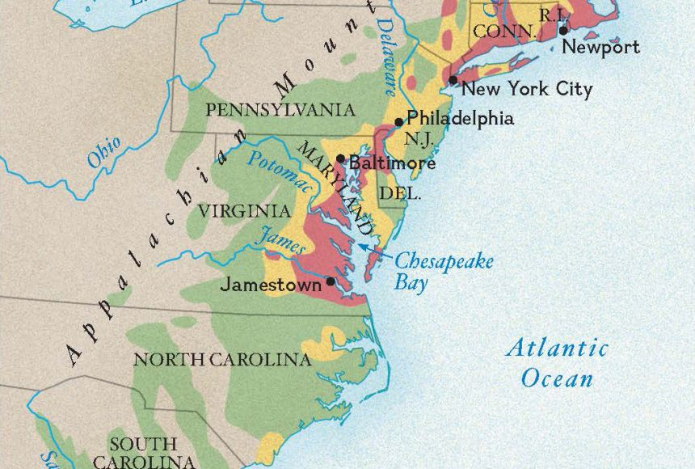

# Essay Two: Colonial Settlement

> [!IMPORTANT]
> **Submission Details & Guidelines:**
> * **Points:** 25 points (Book short essay)
> * **Readings:** *1619* Introduction (pp. 1-13), Chapter One (pp. 14-42), and Epilogue (pp. 213-217).
> * **Format:** 2–3 pages, double-spaced, 12-point Times New Roman font, 1-inch margins.
> * **Citations:** Use parenthetical page number citations for text claims (e.g., Horn, p. 15).
> * **Style:** Analytic essay (not a summary). Engage directly with the text and provide specific page numbers.

---

## Assignment Prompt

The prompt from **[Assignment 2 summer 2311.docx](file:///Users/dcronin05/Library/CloudStorage/OneDrive-SharedLibraries-dcron.in/School%20-%20Documents/Classes/HIST%2021103/notes/sources/processed/assignment_2/Assignment%202%20summer%202311.docx)**:

> In high school, you were likely taught that America was founded for religious freedom. While this is true for some later colonies, it is not exactly true for Virginia.
> 
> In your essay, discuss why the early settlers came to Jamestown, what kind of colony it was, some of the struggles they faced, and how it was governed. Be sure to consider the motivations of the settlers, the economic and political structures that shaped the colony, and the challenges they encountered.
> 
> **Guidelines:**
> * Avoid simply summarizing the text. Instead, focus on analyzing and interpreting the information in your own words.
> * Be precise and specific in your claims to demonstrate that you have carefully read and understood the material.

---

## Historical Map Reference

Below is the historical map included with the assignment materials, illustrating the geographical layout of early Chesapeake settlements along the James River:

---

## Professor's Guidance Notes

Below is a structured summary of the key themes explained by **Professor Jim Ross** in the **[Colonial Settlement Video Lecture](../media/GMT20250527-152216_Recording_1920x924.mp4)** (click for full **[Auto-Generated Video Transcript](./colonial_settlement_video_notes.md)**).

### 1. The Core 1619 Paradox (The Horn Thesis)
* **Twin Births:** The year 1619 represents a fundamental contradiction in American history:
  * The birth of representative democracy in English America (the first meeting of the General Assembly/House of Burgesses, July 30–August 4, 1619).
  * The arrival of the first enslaved Africans to Virginia ( Point Comfort, late August 1619, captured from a Portuguese ship by privateers).
* **The Contradiction:** American liberties and democratic institutions grew in tandem with, and were shaped by, the exclusion and subjugation of Native Americans and Africans.

### 2. Jamestown's Real Motives (Commercial vs. Religious)
* **Money First:** Jamestown was unashamedly a commercial venture. Settlers did not come for religious freedom; they were sent by the joint-stock **Virginia Company of London** (chartered in 1606 by King James I) to extract profit from the land (originally looking for gold).
* **Geopolitics:** The colony also served as a strategic military/political outpost to block Spanish imperial expansion in North America.

### 3. Early Governance and Struggles
* **Authoritarian Rule:** The early colony was not a democracy; it was governed as a militaristic outpost under strict martial law with harsh corporal and capital punishments (e.g., death for theft or desertion).
* **The Starving Time (Winter 1609–1610):** A period of extreme deprivation. Disease, famine, and conflict reduced the population from 500 to only 60 survivors, driving some to cannibalism.
* **Powhatan Confederacy:** The English settled in a hostile, swampy location on the James River. They had poor relations with the powerful Powhatan Confederacy (led by Wahunsonacock/Powhatan) and mistakenly expected the Native Americans to feed them.

### 4. The Shift Toward Success
* **Stabilization:** After the initial near-collapses, the Company stabilized the colony by sending more families (women and children) to build a permanent society.
* **The Tobacco Boom:** The discovery of tobacco as a highly profitable cash crop in European markets created a massive boom and an acute labor shortage.
* **Headright System:** To attract laborers, the Company granted 50 acres of land to anyone who paid for their own or another's passage to Virginia. This drove the massive importation of English indentured servants, laying the groundwork for the later transition to racialized slave labor.

---

## Required Readings & Resources

* **Required Text Chapters:**
  * **[Introduction to 1619](../readings/1619/introduction.md)**
  * **[Chapter 1: Jamestown](../readings/1619/chapter_01.md)**
  * **[Epilogue: After 1619](../readings/1619/epilogue.md)**
* **Media & Lecture Resources:**
  * **[Colonial Settlement Video Lecture](../media/GMT20250527-152216_Recording_1920x924.mp4)**
  * **[Colonial Settlement Audio Recording](../media/GMT20250527-152216_Recording.m4a)**
  * **[Auto-Generated Video Transcript](./colonial_settlement_video_notes.md)**
