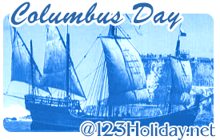

# Christopher Columbus Biography

> **Christopher Columbus (1451–1506)** was an Italian-Spanish navigator who sailed west across the Atlantic Ocean in search of a route to Asia but achieved fame by making landfall in the Americas instead.

On October 12, 1492, two worlds unknown to each other met for the first time on a small island in the Caribbean Sea. While on a voyage for Spain in search of a direct sea route from Europe to Asia, Christopher Columbus unintentionally discovered the Americas. However, in four separate voyages to the Caribbean from 1492 to 1504, he remained convinced that he had found the lands that Marco Polo reached in his overland travels to China at the end of the 13th century. To Columbus, it was only a matter of time before a passage was found through the Caribbean islands to the fabled cities of Asia.

Columbus was not the first European to reach the Americas—Vikings from Scandinavia had briefly settled on the North American coast, in what is now Newfoundland and Labrador, Canada, in the late 10th or early 11th century. However, Columbus’s explorations had a profound impact on the world. They led directly to the opening of the western hemisphere to European colonization; to large-scale exchanges of plants, animals, cultures, and ideas between the two worlds; and, on a darker note, to the deaths of millions of indigenous American peoples from war, forced labor, and disease.

---

## Historical Context & The Age of Discovery

Understanding Christopher Columbus is difficult without understanding the world into which he was born. The 15th century was a century of change, and many events that occurred during that time profoundly affected European society. Many of these events were driven by the centuries-long conflict between Christians and Muslims, followers of the religion known as Islam.

### The Fall of Constantinople (1453)

The event that had the most far-reaching effects on Europe in the 15th century was the fall of the city of Constantinople (modern Istanbul, Turkey) to the Muslim Ottoman Empire. Constantinople had been the capital of the Orthodox Christian Byzantine Empire for centuries, and it was an important center for trade between Europe and Asia. In 1453, the Ottoman Empire, which had already conquered much of southeastern Europe, captured the city, closing an important trade route from Europe to the east.

European merchants could still buy Asian goods from Muslims in places such as Alexandria, Egypt. However, Europeans longed for a sea route to Asia that would allow them to bypass the Muslims and purchase Asian products directly. In addition, European princes and kings quickly realized that the first nation to find such a route could become very wealthy by monopolizing the highly profitable Asian trade.

### The Rise of Portugal and Maritime Exploration

The first European nation to begin actively seeking a sea route to Asia was Portugal. The Portuguese had already begun exploring Africa in the early 1400s, and in 1415 they invaded northern Africa and conquered the Muslim commercial center of Ceuta on the Strait of Gibraltar. This gained the Portuguese access to the lucrative African trade, which, until that time, had been dominated by the Muslims.

Under the tutelage of Prince Henry the Navigator, who established a school for navigators in southern Portugal shortly after the Ceuta invasion, the Portuguese began exploring the western coast of Africa, hoping to find a route to the riches of Asia by going around the southern tip of the continent. Other nations, not wanting to be left behind, began sponsoring voyages of exploration as well. Into this world, full of the excitement of exploration and discovery, Christopher Columbus was born.

---

## Early Life, Family & Education

Biographical facts on Columbus vary from author to author. However, most scholars generally agree that he was born in the Italian port city of Genoa, on the Ligurian Sea (an arm of the Mediterranean Sea), between August 25 and October 31, 1451. His name in Italian was Cristoforo Colombo, which is translated into English as Christopher Columbus, into Spanish as Cristóbal Colón, and into Portuguese as Christovão Colom. Columbus used the Portuguese version of his name while in Portugal and the Spanish version after moving to Spain in 1485.

### Family Background and Genoese Roots

Columbus’s father was Domenico Colombo, a wool weaver who was also involved in local politics. His mother was Suzanna Fontanarossa, the daughter of a wool weaver. The eldest of five children, Christopher had three brothers—Bartholomew, Giovanni Pellegrino, and Giacomo—and one sister, Bianchinetta. The entire family moved to the nearby port city of Savona, west of Genoa, in 1470.

### Education and Guild Schooling

Although how much formal education Columbus received as a child is not known, the schools of Italian craft guilds (which Columbus, as the son of a wool weaver, would have attended) did offer a rudimentary level of reading and writing. As a boy, Christopher joined his father in the family business of wool processing and selling. He may have worked as a clerk in a Genoese bookshop as well. However, as did many other young men who grew up in a major seaport, Columbus soon began a life of seafaring.

---

## Seafaring Career & Relocation to Lisbon

### Early Mediterranean Voyages

Beginning his seagoing career at age 14, Columbus served on various ships in various roles, including messenger, common sailor, and, perhaps, even as a 21-year-old privateer. Columbus’s son Ferdinand stated in *History of the Life and Deeds of Christopher Columbus* that in 1472 Columbus was given command of a ship on a privateering expedition to Tunis in northern Africa. In a lost letter, Columbus supposedly related to his son how René I, duke of the French province of Anjou, had commissioned Columbus to make a surprise attack on a large Spanish ship sailing off the coast of North Africa. Most historians doubt, however, that Columbus ever received command of the expedition.

Much more credible, though, is a subsequent expedition. In 1474, Columbus was hired as a sailor on a ship bound for the island of Khíos in the Aegean Sea, an arm of the eastern Mediterranean Sea. This was his first long voyage and must have proved profitable, because after spending a year on the island he was able to become economically independent from his family. This voyage also represents a great irony in the life of Columbus—the trip to this small island in the Aegean brought him the closest he would ever get to Asia.

### The Atlantic Crossing and Shipwreck (1476)

On August 13, 1476, a Genoese commercial expedition of five ships bound for England gave Columbus his first opportunity to leave the Mediterranean Sea and sail into the Atlantic Ocean. But it was an inauspicious beginning for Columbus: According to tradition, the entire fleet was attacked by French privateers off Cape Saint Vincent on the southwestern tip of Portugal. Both sides lost ships; Columbus, one of the unfortunate ones whose ship was burned, had no escape other than to swim for the Portuguese coast. He made it the 10 km (6 mi) to shore by clinging to wreckage. After regaining his strength in the port of Lagos, Columbus made his way to Lisbon and its large community of Genoese merchants and shipbuilders. He was 25 years old.

### Life and Work in Lisbon

By 1477, Columbus was settled in Lisbon. Since the beginning of Portuguese voyages of exploration in the middle of the 14th century, Lisbon had become a haven for explorers, adventurers, entrepreneurs, merchants, and any others who saw their fortunes tied to the trade winds and ocean currents. Columbus’s brother Bartholomew worked in Lisbon as a mapmaker, and for a time the brothers worked together as draftsmen and book collectors. Later that year, Columbus set sail on a convoy loaded with goods to be sold in northern Atlantic ports.

---

## Marriage & Atlantic Voyages

### Marriage to Felipa Perestrello

In 1478 or 1479, Columbus met and married Felipa Perestrello e Moniz, the daughter of a respected, though relatively poor, noble family. Felipa’s father, Bartolomeo Perestrello, who was already deceased when Columbus met Felipa, had served as governor of Porto Santo in the Madeira Islands, a Portuguese possession off the northwest coast of Africa.

Soon after their marriage, the newlyweds accompanied the rest of the family back to Porto Santo, where Felipa’s oldest brother took over the governorship. Columbus and Felipa moved to the larger island of Madeira in 1480 or 1481, soon after their son Diego was born. It is believed that Felipa died soon thereafter.

### West African Voyages and the Canaries Current

In late 1481 or early 1482, Columbus sailed to the Portuguese fortress of Elmina, in what is now Ghana, on the western coast of Africa. Columbus was impressed with the riches Africa offered, especially gold. In addition, like all good navigators, he was eager to learn about winds and ocean currents from the local pilots and sailors.

In the waters off the coast of Africa and the nearby Canary Islands, Columbus first observed the ocean phenomenon known as the Canaries Current. Knowledge of this fast-moving current running west of the Canary Islands could well have been the reason that Columbus later chose to start his crossing of the Atlantic in the latitude of the Canaries, far south of Spain or Portugal.

---

## Genesis of the "Enterprise of the Indies"

The experiences of these years led directly to the genesis of Columbus’s plan to reach the east by going west, what he called his “Enterprise of the Indies.” (To Europeans in Columbus’s day, all lands to the east of the Indus River in Asia were “the Indies.”)

Inspiration and assistance for his plan came from a number of sources:

- **Family Connections**: His marriage into the Portuguese nobility proved helpful because, although relatively poor, the family still had connections to the Portuguese court. Columbus apparently gained access to his father-in-law’s papers and found a wealth of information, including maps, charts revealing ocean currents, interviews with sailors, and stories about objects that had drifted to the coast of the Madeira Islands from the west.
- **Association & Trade**: His association with the Genoese community in Portugal and his expeditions to Africa furthered his knowledge of Atlantic waters.
- **Northern Accounts**: While in ports in England, Ireland, and Iceland, Columbus may have heard stories of lands to the west of Iceland. Although the histories of the Vikings, who settled Iceland and Greenland in the 9th and 10th centuries, never became part of the knowledge base of medieval Europeans, it is believed that stories of their encounters with unknown islands in the northern Atlantic were widespread.

Columbus’s genius was his remarkable ability to gather information from around the Mediterranean and the Atlantic and combine his own experiences with ancient theories from books in a way that few navigators could.

---

## Geographic Theories & Calculations

Columbus’s idea of sailing west to get to the east was not original with him, nor did he ever claim that it was. Columbus drew upon science and knowledge accumulated over thousands of years. In Greek and Roman times, for example, geographers theorized that there was only one body of water on the surface of the Earth and that it connected Europe and Asia. If so, one could theoretically sail from the west to get to the east. Only the distance was disputed.

### Influential Cartographic and Literary Works

Columbus’s ideas of the size of the earth and the distance between Europe and Asia were based on the descriptions contained in several geographic works:

1. *Geography* by Ptolemy (2nd-century manuscript)
2. *Imago Mundi* (Image of the World) by Pierre d’Ailly (published in the early 1480s)
3. *The Travels of Marco Polo* (written in 1298)

### Mistaken Assumptions and Undersized Earth

Unfortunately, his calculations did not prove particularly accurate. Columbus founded his theory on two mistaken propositions:

- That the Asian continent stretched much farther to the east than it actually does.
- That Japan lay about 2,400 km (about 1,500 mi) east of the Asian mainland.

Columbus also greatly underestimated the circumference of the earth. He calculated that the Canary Islands lay only about 4,440 km (about 2,760 mi) from Japan; the actual distance is about 19,000 km (about 12,000 mi). Similar errors were made by other learned men of the time, including the Florentine geographer Paulo de Pozzo Toscanelli, with whom Columbus may have corresponded. Neither Columbus nor anyone else in Europe suspected that two vast continents lay in the way of a westward passage to Asia.

---

## Seeking Royal Patronage in Portugal

Columbus decided to seek patronage for his plan first in Portugal. With few interruptions, the Portuguese crown had encouraged and supported exploration for over a century, and nearly all new discoveries in the Atlantic were Portuguese. Furthermore, it was well known that the reigning monarch, King John II, was personally committed to sailing around Africa and discovering a direct sea route to the Indian Ocean and Asia.

### Proposal to King John II (1484)

The king’s strong support of geographical exploration made him a logical choice for Columbus to approach. According to tradition, in 1484, the king listened to Columbus’s proposal to sail to the east by going west and summarily passed it on to his Council of Geographical Affairs.

### Denial by the Council of Geographical Affairs

After a public hearing, the council denied the request on the grounds that:

1. The project was too expensive.
2. Columbus was wrong about distances and measurements.
3. Such a plan contradicted Portugal’s commitment to finding an eastward route to Asia by traveling around Africa.

---

*Source: Microsoft Encarta*
