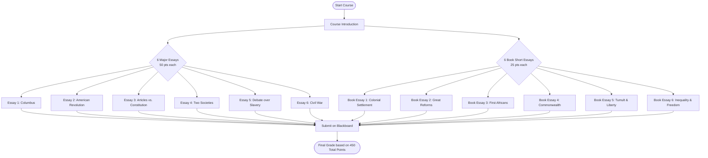

# United States History to 1877

**Online Course | Dr. Jim Ross**

---

## Contact Information

| Contact Method   | Details                                                          |
| :--------------- | :--------------------------------------------------------------- |
| **Instructor**   | Dr. Jim Ross                                                     |
| **Office Phone** | 501-569-8395                                                     |
| **Email Policy** | **Use Blackboard Messages Only** (Do not email the UALR account) |

---

## Course Description

This course provides a broad overview of United States history from the 16th century to the Reconstruction era.

There are two ways to study history:

1. **Fact Memorization**: Memorizing names and dates without a coherent narrative, assessed via multiple-choice tests.
2. **Thematic Exploration**: Exploring history by using a theme to tease out the meaning of the past, assessed via writing.

We will use the **thematic and writing-intensive approach**. Because this is an online class, you need to stay focused, read carefully, and keep up with all assignments.

---

## Required Text

> [!NOTE]
>
> **Required Text:**
>
> - **[James Horn, 1619: Jamestown and the Founding of American Democracy](./readings/1619_jamestown_and_the_founding_of_american_democracy.md)**
>
> *A PDF copy of this book is provided under the resources area on Blackboard. A traditional textbook is not required.*

---

## Course Requirements & Grading

Your course grade is based entirely on writing. There are **12 total assignments** worth **450 points**:

| Assignment Type        | Count  | Description                                                                                                                 | Points      | Total       |
| :--------------------- | :----- | :-------------------------------------------------------------------------------------------------------------------------- | :---------- | :---------- |
| **Major Essays**       | 6      | 2–3 pages, double-spaced, 12pt font, focused on primary sources.                                                            | 50 pts each | **300 pts** |
| **Book Short Essays**  | 6      | 1–2 page summaries/responses on the [James Horn book](./readings/1619_jamestown_and_the_founding_of_american_democracy.md). | 25 pts each | **150 pts** |
| **Total Course Grade** | **12** |                                                                                                                             |             | **450 pts** |

### Course Workflow Map

---

## Important Course Policies

### Communication Policy

> [!IMPORTANT]
>
> **Use Blackboard Messages Only:**
>
> - Please do **NOT** email the instructor at their UALR email account.
> - Do not email any assignments. All papers must be uploaded to the Blackboard portal under the respective assignment links.
> - Messages are checked twice daily (once in the morning and once in the evening).

### Self-Pacing & Due Dates

> [!TIP]
>
> **Suggested Deadlines & Late Policy:**
>
> - There are **no late penalties** or rigid weekly due dates.
> - All work must be submitted by **June 29 at 11:59 PM (CDT)**.
> - *Crucial Recommendation:* To stay ahead and write high-quality papers, target completing **2–3 assignments per week**. Waiting until the last minute will result in poor performance due to the intensive reading and writing requirements.

### Academic Integrity & AI Use

> [!CAUTION]
>
> **Generative AI Policy:**
>
> - The use of generative artificial intelligence (AI), including tools like ChatGPT, Claude, or similar programs, is **not permitted** for any writing assignments in this course.
> - Your essays must reflect your own critical thinking, reasoning, and independent voice.
> - Relying on AI short-circuits the learning process and defeats the objective of developing analytical writing skills.

> [!WARNING]
>
> **Plagiarism Policy:**
>
> - All work must reflect your own thoughts, words, and efforts.
> - Academic dishonesty of any kind will be reported to the Office of the Dean of Students and could result in a failing grade on the assignment or for the entire course.

---

## Student Learning Objectives

Students in this core course will demonstrate:

1. **Historical Knowledge**: Understanding of key figures, names, dates, chronologies, events, and concepts.
2. **Contextual Diversity**: Understanding of the complex historical context that shapes human experiences.
3. **Causation & Interaction**: Understanding of the interrelatedness of historical events, including continuity and change, causation, and interaction between differing groups.
4. **Thesis Formulation**: Organizing and articulating ideas clearly in an essay that presents a relevant, evidence-supported thesis.

---

## UALR Institutional Policies

### Students with Disabilities

UALR is committed to creating inclusive learning environments. If there are aspects of this course that present barriers (e.g. time limits, non-captioned videos, or web accessibility), please notify the instructor immediately. You may also contact the **Disability Resource Center** at **501-569-3143** or visit [DRC Website](http://ualr.edu/disability/).

### Web Accessibility

It is the policy and practice of UALR to make all web information accessible to students with disabilities. If you experience difficulty accessing any part of these materials, please alert the instructor immediately.

### Weather Policy

UALR closes for inclement weather when the Little Rock public schools close. If the university remains open but road conditions in your specific area are dangerous, use your best judgment. Inform the instructor before class time if weather prevents you from traveling or participating, and coordinate on making up any missed work.
